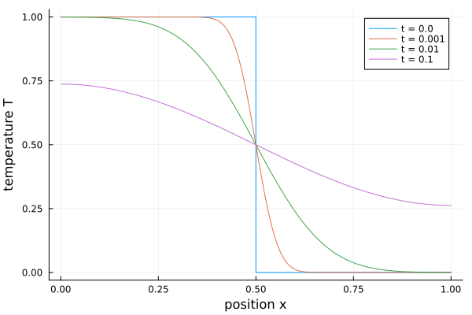
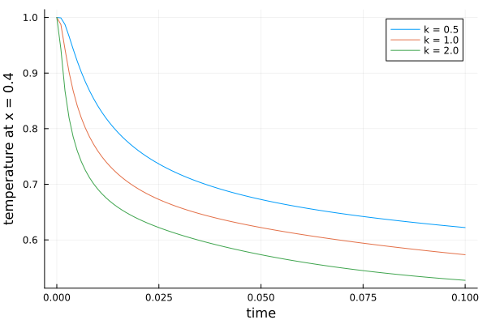
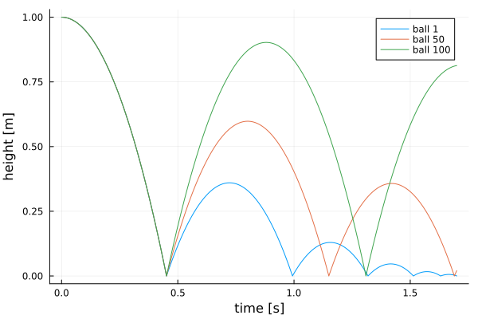

# Large array models

By default the frontend scalarizes a model: an array of 10 000 components becomes
10 000 copies of every variable and equation, and the generated code grows with
them. With `scalarize = false` (experimental) the arrays stay arrays: the frontend
keeps array variables, for-equations and array equations, and the backend
generates code that keeps the loops. Translating and simulating then take about
as long for 10 000 elements as for 10.

```julia
OM.simulate("Rod", "Rod.mo"; scalarize = false)   # one call
OM.SCALARIZE[] = false                            # or for all later calls
```

A model the array code generation does not handle (see [What is kept](#What-is-kept))
is scalarized when the backend receives it and simulates as before, so
`scalarize = false` is safe to try on any model.

## Heat conduction in a rod

A rod split into `n` segments: each segment stores heat, each conductor passes it
on to the next. The left half starts hot.

```modelica
connector HeatPort
  Real T "Temperature";
  flow Real Q "Heat flow";
end HeatPort;

model Segment "A slice of the rod: heat capacity C"
  parameter Real C = 1;
  parameter Real T0 = 0;
  HeatPort p;
  Real T(start = T0, fixed = true);
equation
  T = p.T;
  C * der(T) = p.Q;
end Segment;

model Conductor "Conduction G between two slices"
  parameter Real G = 1;
  HeatPort a, b;
equation
  a.Q + b.Q = 0;
  a.Q = G * (a.T - b.T);
end Conductor;

model Rod "Heat conduction in a rod of n segments, hot left half"
  parameter Integer n = 10000 "Number of segments";
  parameter Real L = 1 "Length";
  parameter Real k = 1 "Thermal diffusivity";
  parameter Real dx = L / n;
  Segment s[n](each C = dx, T0 = {if i <= n / 2 then 1.0 else 0.0 for i in 1:n});
  Conductor c[n - 1](each G = k / dx);
equation
  for i in 1:n - 1 loop
    connect(s[i].p, c[i].a);
    connect(c[i].b, s[i + 1].p);
  end for;
end Rod;
```

```julia
using OM, Plots
sol = OM.simulate("Rod", "Rod.mo"; scalarize = false, stopTime = 0.1)

x = ((1:10000) .- 0.5) ./ 10000
p = plot(; xlabel = "position x", ylabel = "temperature T")
for t in (0.0, 0.001, 0.01, 0.1)
  plot!(p, x, sol(t); label = "t = $t")
end
p
```



The model has 10 000 states and 60 000 algebraic variables (the connector
temperatures and heat flows). The generated code is 11 loops, the same for any
`n`, and translating and simulating it take under two seconds together. With
1 000 segments the same model takes 0.4 s with `scalarize = false` and 7.6 s
scalarized, with the same result. (Times of a second run in a Julia session;
the first run also compiles.)

Variables are read by their Modelica names, states and algebraic variables alike:

```julia
OM.OMBackend.getVariableValues(sol, "s[5000].T")
sol(0.05; idxs = Symbol("c[1].a.Q"))
```

## Changing parameters

Parameters are passed to the generated code as data, so every parameter can be
changed in `resimulate` without translating again, also single elements of
parameter arrays (`"s[3].C"`). Parameters whose bindings use a changed one follow
it: the conductances `G = k / dx` below.

```julia
p = plot(; xlabel = "time", ylabel = "temperature at x = 0.4")
for k in (0.5, 1.0, 2.0)
  s = OM.resimulate("Rod"; stopTime = 0.1, saveat = 0.001, parameters = Dict("k" => k))
  plot!(p, s.t, OM.OMBackend.getVariableValues(s, "s[4000].T"); label = "k = $k")
end
p
```



Parameters that fix the structure, such as `n` here (array sizes, subscripts),
need a new translation.

## A hundred bouncing balls

A `when`-equation inside a for-loop: each ball has its own coefficient of
restitution and counts its bounces in a discrete variable.

```modelica
model BouncingBalls "n balls, each with its own coefficient of restitution"
  parameter Integer n = 100;
  parameter Real g = 9.81;
  parameter Real e[n] = {0.6 + 0.35 * (i - 1) / (n - 1) for i in 1:n};
  Real h[n](each start = 1.0, each fixed = true) "Heights";
  Real v[n](each start = 0.0, each fixed = true) "Velocities";
  discrete Integer bounces[n](each start = 0);
equation
  for i in 1:n loop
    der(h[i]) = v[i];
    der(v[i]) = -g;
    when h[i] <= 0.0 then
      reinit(v[i], -e[i] * pre(v[i]));
      bounces[i] = pre(bounces[i]) + 1;
    end when;
  end for;
end BouncingBalls;
```

```julia
sol = OM.simulate("BouncingBalls", "BouncingBalls.mo"; scalarize = false,
                  stopTime = 1.7, saveat = 0.002)
p = plot(; xlabel = "time [s]", ylabel = "height [m]")
for i in (1, 50, 100)
  plot!(p, sol.t, OM.OMBackend.getVariableValues(sol, "h[$i]"); label = "ball $i")
end
p
sol(1.7; idxs = Symbol("bounces[1]"))   # 5.0
```



This takes under a second; scalarized, the hundred `when`-equations take about
35 s to translate and simulate.

## What is kept

The array code generation takes a model when:

- every equation can be solved for one unknown (a state derivative or an algebraic
  variable) without an algebraic loop or index reduction; equations from connections,
  for-loops and array equations (`der(x) = -k .* x`) are all fine;
- relations on continuous variables (`if x > y then ...`) become events, `when`-equations
  (also in for-loops) may assign discrete variables and `reinit` states; `pre`, `noEvent`,
  `smooth` and `homotopy` are understood;
- asserts are checked after every step.

Not yet: algebraic loops, index reduction, initial equations, algorithms,
if-equations, `elsewhen`, `sample`, `initial()`, `edge`/`change` and the
event-generating functions (`div`, `mod`, `floor`, ...). Such a model is scalarized
when the backend receives it (the reason is logged) and simulated as with
`scalarize = true`.
