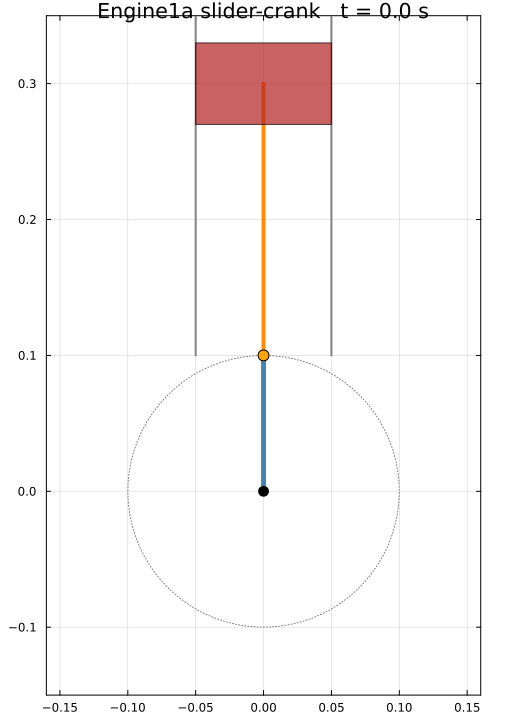
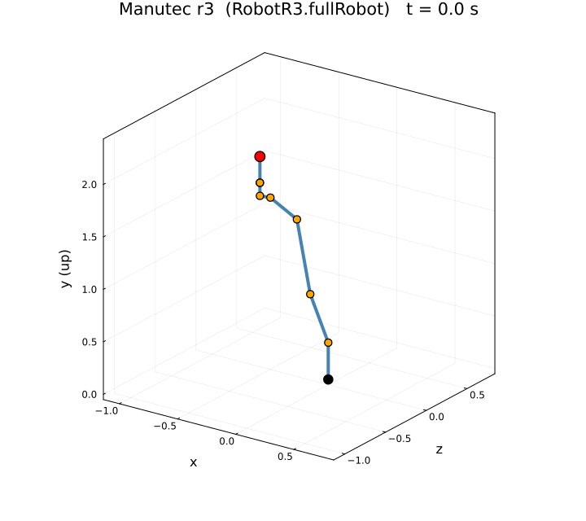

# Examples

## A simple pendulum

```julia
using OM
sol = OM.simulate("Modelica.Mechanics.MultiBody.Examples.Elementary.Pendulum";
                  MSL_Version = "MSL:3.2.3", stopTime = 1.0)
```

## Showcase: validated multibody systems

OM.jl is also exercised against substantially larger Modelica Standard Library
models. These examples cover closed kinematic loops, electric drives, friction,
controllers, and hybrid events. They are useful end-to-end demonstrations of
the frontend, backend, ModelingToolkit code generation, and SciML simulation
pipeline.

!!! note "First-run compilation"
    These are intentionally demanding models. Their first translation and
    simulation can take several minutes while Julia compiles the generated
    system. Repeated runs reuse the compiled model and are much faster.

### Closed-loop engine

`Engine1a` is a crank, connecting-rod, and piston mechanism with a closed
kinematic loop. The repository validates its simulated crank trajectory against
an OpenModelica reference.



*Engine1a rendered from the simulated crankshaft angle.*

```julia
using OM

engine = OM.simulate(
    "Modelica.Mechanics.MultiBody.Examples.Loops.Engine1a";
    MSL_Version = "MSL:3.2.3",
    stopTime = 0.72,
)

engine.retcode
OM.exportCSV(
    "Modelica.Mechanics.MultiBody.Examples.Loops.Engine1a",
    engine;
    filePath = "Engine1a_res.csv",
)
```

### Full six-axis robot

`RobotR3.fullRobot` combines six controlled axes, electric motors, gear trains,
bearing friction, and three-dimensional multibody mechanics. The coverage suite
validates 42 result signals against the Dymola MSL 3.2.3 reference.



*The Manutec r3 arm rendered from the six simulated joint trajectories.*

```julia
using OM

robot = OM.simulate(
    "Modelica.Mechanics.MultiBody.Examples.Systems.RobotR3.fullRobot";
    MSL_Version = "MSL:3.2.3",
    stopTime = 1.85,
    dense = false,
)

robot.retcode
OM.exportCSV(
    "Modelica.Mechanics.MultiBody.Examples.Systems.RobotR3.fullRobot",
    robot;
    filePath = "RobotR3_fullRobot_res.csv",
)
```

## Translate without simulating

Build the in-memory model (frontend + backend) and inspect or solve it later:

```julia
OM.translate("Modelica.Electrical.Analog.Examples.DifferenceAmplifier";
             MSL_Version = "MSL:3.2.3")
prob = OM.getMTKProblem("Modelica.Electrical.Analog.Examples.DifferenceAmplifier")
```

## Flatten only (frontend)

```julia
(flatModel, functions) = OM.flatten("Modelica.Mechanics.MultiBody.Examples.Elementary.Pendulum")
```

## Export results

```julia
sol = OM.simulate("Modelica....SomeModel"; MSL_Version = "MSL:3.2.3", stopTime = 1.0)
OM.exportCSV("Modelica....SomeModel", sol; filePath = "result.csv")
```
