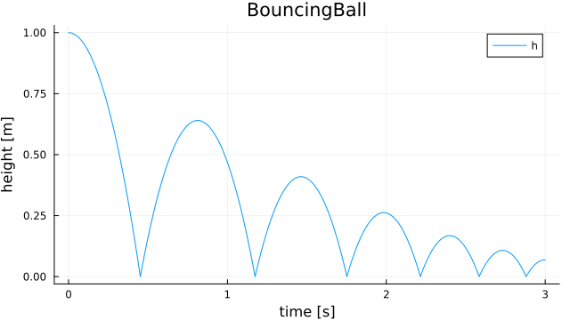
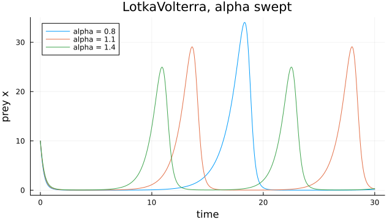
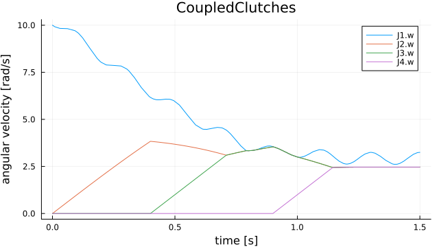
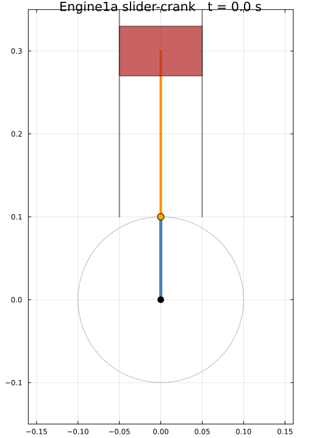
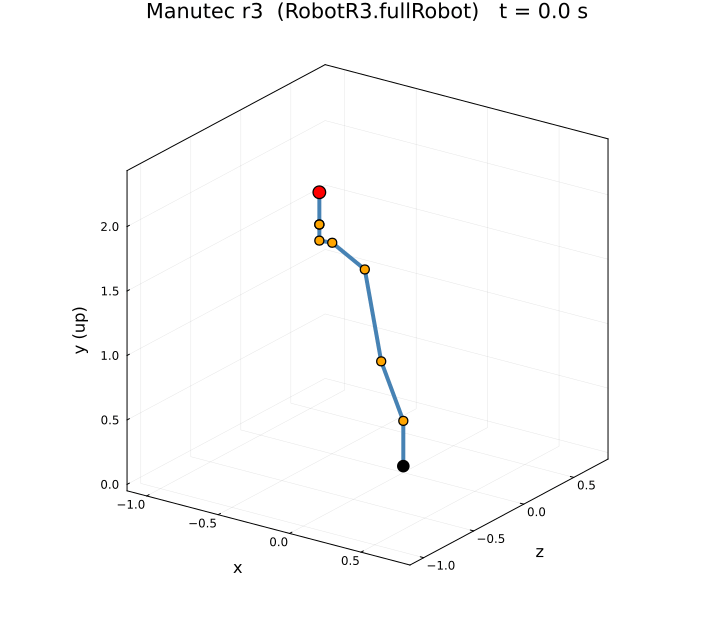

# Examples

The examples run in the OM.jl project environment (`julia --project` in the
repository), which also provides Plots and DifferentialEquations.

## A simple pendulum

```julia
using OM
sol = OM.simulate("Modelica.Mechanics.MultiBody.Examples.Elementary.Pendulum";
                  MSL_Version = "MSL:3.2.3", stopTime = 1.0)
```

## Your own model, with events

Write the model to a file and simulate it by name. `when` equations become
events of the solver; `saveat` sets the output grid.

```modelica
model BouncingBall
  parameter Real g = 9.81 "Gravity";
  parameter Real e = 0.8 "Coefficient of restitution";
  Real h(start = 1.0, fixed = true) "Height";
  Real v(start = 0.0, fixed = true) "Velocity";
equation
  der(h) = v;
  der(v) = -g;
  when h <= 0.0 then
    reinit(v, -e * pre(v));
  end when;
end BouncingBall;
```

```julia
using OM, Plots
sol = OM.simulate("BouncingBall", "BouncingBall.mo"; stopTime = 3.0, saveat = 0.01)
h = OM.OMBackend.getVariableValues(sol, "h")
plot(sol.t, h; xlabel = "time [s]", ylabel = "height [m]", label = "h")
```



Each bounce reaches ``e^2`` of the previous height (0.64 m after the first).
`getVariableValues` takes Modelica names (`"h"`, `"J1.w"`).

## Look at the flat model

```julia
print(OM.exportModelica("BouncingBall", "BouncingBall.mo"))
```

`OM.flatten` returns the frontend's flat model as a data structure instead.

## Change parameters without recompiling

Parameters are folded into the generated code as constants unless they are
declared tunable when the model is translated. Tunable parameters can then be
changed in `resimulate`, which reuses the compiled model:

```modelica
model LotkaVolterra
  parameter Real alpha = 1.1 "Prey growth";
  parameter Real beta = 0.4 "Predation";
  parameter Real gamma = 0.4 "Predator death";
  parameter Real delta = 0.1 "Predator growth";
  Real x(start = 10.0, fixed = true) "Prey";
  Real y(start = 10.0, fixed = true) "Predators";
equation
  der(x) = alpha * x - beta * x * y;
  der(y) = delta * x * y - gamma * y;
end LotkaVolterra;
```

```julia
OM.OMBackend.withTunableParameters(["alpha"]) do
  OM.translate("LotkaVolterra", "LotkaVolterra.mo")
end

p = plot(; xlabel = "time", ylabel = "prey x")
for alpha in (0.8, 1.1, 1.4)
  s = OM.resimulate("LotkaVolterra"; stopTime = 30.0, saveat = 0.05,
                    parameters = Dict("alpha" => alpha))
  plot!(p, s.t, OM.OMBackend.getVariableValues(s, "x"); label = "alpha = $alpha")
end
p
```



The three runs take about a second together; only the first translation
compiles.

## Solver and tolerances

`simulate` and `resimulate` take any SciML solver; other keyword arguments
(`reltol`, `abstol`, `saveat`, `dtmax`, ...) go to `solve`. The default is
`Rodas5P` with finite-difference Jacobians.

```julia
import DifferentialEquations as DE
sol = OM.simulate("LotkaVolterra"; stopTime = 30.0, solver = DE.Tsit5(),
                  reltol = 1e-8, abstol = 1e-8)
```

## Solve the problem yourself

`getMTKProblem` builds the problem of a translated model without solving it.
Its first two results are the `ODEProblem` and the model's event callbacks
(for BouncingBall, the bounces); pass both to `solve`:

```julia
prob, callbacks = OM.getMTKProblem("LotkaVolterra"; tspan = (0.0, 30.0))
sol = DE.solve(prob, DE.Rodas5P(); callback = callbacks)

longer = DE.solve(DE.remake(prob; tspan = (0.0, 60.0)), DE.Rodas5P(); callback = callbacks)
```

MSL models work the same way after `OM.translate(name; MSL_Version = "MSL:3.2.3")`.

## An MSL model with friction events

`CoupledClutches` drives four inertias through three clutches that slip and
lock as they are engaged and released:

```julia
name = "Modelica.Mechanics.Rotational.Examples.CoupledClutches"
cc = OM.simulate(name; MSL_Version = "MSL:3.2.3", stopTime = 1.5)

p = plot(; xlabel = "time [s]", ylabel = "angular velocity [rad/s]")
for n in ("J1.w", "J2.w", "J3.w", "J4.w")
  plot!(p, cc.t, OM.OMBackend.getVariableValues(cc, n); label = n)
end
p

OM.exportCSV(name, cc; filePath = "CoupledClutches_res.csv")  # opens in OMEdit
```



## Scripts

The same models can be run from an OpenModelica `.mos` script with
`OM.runScript`; see [Scripting (`.mos`)](scripting.md).

## Showcase: validated multibody systems

OM.jl is also exercised against substantially larger Modelica Standard Library
models. These examples cover closed kinematic loops, electric drives, friction,
controllers, and hybrid events. They are useful end-to-end demonstrations of
the frontend, backend, ModelingToolkit code generation, and SciML simulation
pipeline.

!!! note "First-run compilation"
    These are intentionally demanding models. Their first translation and
    simulation can take several minutes while Julia compiles the generated
    system. Repeated runs reuse the compiled model and are much faster.

### Closed-loop engine

`Engine1a` is a crank, connecting-rod, and piston mechanism with a closed
kinematic loop. The repository validates its simulated crank trajectory against
an OpenModelica reference.



*Engine1a rendered from the simulated crankshaft angle.*

```julia
using OM

engine = OM.simulate(
    "Modelica.Mechanics.MultiBody.Examples.Loops.Engine1a";
    MSL_Version = "MSL:3.2.3",
    stopTime = 0.72,
)

engine.retcode
OM.exportCSV(
    "Modelica.Mechanics.MultiBody.Examples.Loops.Engine1a",
    engine;
    filePath = "Engine1a_res.csv",
)
```

### Full six-axis robot

`RobotR3.fullRobot` combines six controlled axes, electric motors, gear trains,
bearing friction, and three-dimensional multibody mechanics. The coverage suite
validates 42 result signals against the Dymola MSL 3.2.3 reference.



*The Manutec r3 arm rendered from the six simulated joint trajectories.*

```julia
using OM

robot = OM.simulate(
    "Modelica.Mechanics.MultiBody.Examples.Systems.RobotR3.fullRobot";
    MSL_Version = "MSL:3.2.3",
    stopTime = 1.85,
    dense = false,
)

robot.retcode
OM.exportCSV(
    "Modelica.Mechanics.MultiBody.Examples.Systems.RobotR3.fullRobot",
    robot;
    filePath = "RobotR3_fullRobot_res.csv",
)
```

## Flatten only (frontend)

```julia
(flatModel, functions) = OM.flatten("Modelica.Mechanics.MultiBody.Examples.Elementary.Pendulum")
```
